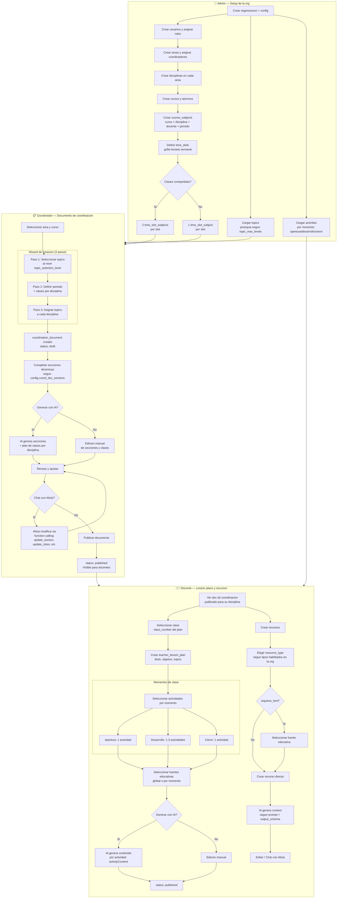

# DB Productiva - Propuesta

## Resumen del sistema

Sistema multi-tenant de planificacion educativa anual. Cada organizacion (colegio, universidad) es un tenant con configuracion propia via `organizations.config` (JSONB).

**Roles:**
- **Coordinador**: crea documentos de coordinacion que definen que se ensena por disciplina en un periodo (topics, plan de clases, secciones configurables por org)
- **Docente**: a partir del documento de coordinacion, crea lesson plans clase a clase (momentos con actividades, fuentes) y recursos (guias, fichas, etc.)
- **Admin**: gestion de la organizacion, usuarios, configuracion

**Flujo principal:**
1. Coordinador crea **coordination_document** para un area → selecciona topics, asigna a disciplinas, genera plan de clases con IA
2. Docente ve el plan y crea **teacher_lesson_plans** por clase → selecciona actividades por momento (apertura/desarrollo/cierre), IA genera contenido por actividad
3. Docente crea **resources** (guias de lectura, fichas de curso, etc.) usando tipos configurables con generacion IA

**Multi-tenancy**: todas las tablas principales tienen `organization_id` (incluido `users`, que pertenece a una unica org). La config de org controla: niveles de topics, secciones del doc de coordinacion, clases compartidas, tipos de recursos, etc.

## Enums

```sql
CREATE TYPE coord_doc_status AS ENUM ('pending', 'in_progress', 'published');
CREATE TYPE lesson_plan_status AS ENUM ('pending', 'in_progress', 'published');
CREATE TYPE resources_mode AS ENUM ('global', 'per_moment');
CREATE TYPE class_moment AS ENUM ('apertura', 'desarrollo', 'cierre');
CREATE TYPE member_role AS ENUM ('teacher', 'coordinator', 'admin');
CREATE TYPE resource_status AS ENUM ('draft', 'active');
```

## Diagrama ER

```mermaid
erDiagram
    organizations {
        SERIAL id PK
        VARCHAR name
        VARCHAR slug UK
        JSONB config
        TIMESTAMP created_at
        ___ ___ "Tenant. Config JSONB define comportamiento por org"
    }

    users {
        SERIAL id PK
        INTEGER organization_id FK
        VARCHAR email UK
        VARCHAR name
        TEXT password_hash
        TEXT avatar_url
        TIMESTAMP created_at
        ___ ___ "Docentes, coordinadores, admins. Pertenecen a una unica org"
    }

    user_roles {
        SERIAL id PK
        INTEGER user_id FK
        member_role role
        UNIQUE user_id_role
        ___ ___ "Roles del usuario en su org: teacher, coordinator, admin. Puede tener varios"
    }

    areas {
        SERIAL id PK
        INTEGER organization_id FK
        VARCHAR name
        TEXT description
        TIMESTAMP created_at
        ___ ___ "Agrupacion de disciplinas (ej: Ciencias). Opcional segun config"
    }

    area_coordinators {
        SERIAL id PK
        INTEGER area_id FK
        INTEGER user_id FK
        UNIQUE area_id_user_id
        ___ ___ "Que usuarios coordinan que areas (M2M)"
    }

    subjects {
        SERIAL id PK
        INTEGER organization_id FK
        INTEGER area_id FK
        VARCHAR name
        TEXT description
        TIMESTAMP created_at
        ___ ___ "Disciplinas individuales (ej: Matematicas). Pertenecen a un area"
    }

    topics {
        SERIAL id PK
        INTEGER organization_id FK
        INTEGER parent_id FK "self-ref, NULL=raiz"
        VARCHAR name
        TEXT description
        INTEGER level "precalculado, arranca en 1"
        TIMESTAMP created_at
        ___ ___ "Jerarquia dinamica de temas/saberes. Self-ref con niveles configurables"
    }

    courses {
        SERIAL id PK
        INTEGER organization_id FK
        VARCHAR name
        TIMESTAMP created_at
        ___ ___ "Grupos de alumnos (ej: 2do 1era)"
    }

    students {
        SERIAL id PK
        INTEGER course_id FK
        VARCHAR name
        TIMESTAMP created_at
        ___ ___ "Alumnos de un curso. Solo lectura informativa"
    }

    course_subjects {
        SERIAL id PK
        INTEGER course_id FK
        INTEGER subject_id FK
        INTEGER teacher_id FK
        DATE start_date
        DATE end_date
        INTEGER school_year
        TIMESTAMP created_at
        ___ ___ "Instancia: curso + disciplina + docente + periodo lectivo"
    }

    time_slots {
        SERIAL id PK
        INTEGER course_id FK
        SMALLINT day_of_week
        TIME start_time
        TIME end_time
        TIMESTAMP created_at
        ___ ___ "Slots horarios semanales de un curso (dia + hora)"
    }

    time_slot_subjects {
        SERIAL id PK
        INTEGER time_slot_id FK
        INTEGER course_subject_id FK
        UNIQUE time_slot_id_course_subject_id
        ___ ___ "course_subjects por slot. 2 registros = clase compartida"
    }

    coordination_documents {
        SERIAL id PK
        INTEGER organization_id FK
        VARCHAR name
        INTEGER area_id FK
        DATE start_date
        DATE end_date
        coord_doc_status status "DEFAULT pending"
        JSONB sections "dinamico segun org config coord_doc_sections"
        TIMESTAMP created_at
        TIMESTAMP updated_at
        ___ ___ "OUTPUT PRINCIPAL. Planificacion anual de un area con secciones dinamicas"
    }

    coord_doc_topics {
        SERIAL id PK
        INTEGER coordination_document_id FK
        INTEGER topic_id FK
        UNIQUE coordination_document_id_topic_id
        ___ ___ "Junction: topics seleccionados para el doc al nivel de topic_selection_level"
    }

    coordination_document_subjects {
        SERIAL id PK
        INTEGER coordination_document_id FK
        INTEGER subject_id FK
        INTEGER class_count
        ___ ___ "Disciplinas incluidas en el doc con cantidad de clases en el periodo"
    }

    coord_doc_subject_topics {
        SERIAL id PK
        INTEGER coord_doc_subject_id FK
        INTEGER topic_id FK
        UNIQUE coord_doc_subject_id_topic_id
        ___ ___ "Junction: topics asignados a una disciplina dentro del doc"
    }

    coord_doc_classes {
        SERIAL id PK
        INTEGER coord_doc_subject_id FK
        INTEGER class_number
        VARCHAR title
        TEXT objective
        ___ ___ "Plan de clases por disciplina generado por IA: numero, titulo, objetivo"
    }

    coord_doc_class_topics {
        SERIAL id PK
        INTEGER coord_doc_class_id FK
        INTEGER topic_id FK
        UNIQUE coord_doc_class_id_topic_id
        ___ ___ "Junction: topics cubiertos en cada clase individual"
    }

    activities {
        SERIAL id PK
        INTEGER organization_id FK
        class_moment moment
        VARCHAR name
        TEXT description
        INTEGER duration_minutes
        TIMESTAMP created_at
        ___ ___ "Actividades didacticas predefinidas por org y momento (apertura/desarrollo/cierre)"
    }

    teacher_lesson_plans {
        SERIAL id PK
        INTEGER course_subject_id FK
        INTEGER coordination_document_id FK
        INTEGER class_number
        VARCHAR title
        TEXT objective
        TEXT knowledge_content
        TEXT didactic_strategies
        VARCHAR class_format
        JSONB moments
        lesson_plan_status status "DEFAULT pending → in_progress → published"
        TEXT custom_instruction
        resources_mode resources_mode
        TIMESTAMP created_at
        TIMESTAMP updated_at
        ___ ___ "Planificación docente. Momentos con actividades + contenido IA"
    }

    lesson_plan_topics {
        SERIAL id PK
        INTEGER lesson_plan_id FK
        INTEGER topic_id FK
        UNIQUE lesson_plan_id_topic_id
        ___ ___ "Junction: topics cubiertos en un lesson plan"
    }

    lesson_plan_moment_fonts {
        SERIAL id PK
        INTEGER lesson_plan_id FK
        class_moment moment "NULL = global (aplica a todos los momentos)"
        INTEGER font_id FK
        UNIQUE lesson_plan_id_moment_font_id
        ___ ___ "Junction: font por momento o global en un lesson plan"
    }

    fonts {
        SERIAL id PK
        INTEGER organization_id FK
        VARCHAR name
        TEXT description
        TEXT file_url
        VARCHAR file_type
        TEXT thumbnail_url
        INTEGER area_id FK
        BOOLEAN is_validated
        TIMESTAMP created_at
        ___ ___ "Fuentes educativas (PDFs, videos, docs). is_validated = aprobado por coordinadores"
    }

    resource_types {
        SERIAL id PK
        VARCHAR key UK "ej: lecture_guide, course_sheet"
        VARCHAR name
        TEXT description
        TEXT prompt "default AI prompt"
        JSONB output_schema "default output structure"
        INTEGER organization_id FK "NULL = publico, set = privado"
        BOOLEAN requires_font "DEFAULT false"
        BOOLEAN is_active "DEFAULT true"
        TIMESTAMP created_at
        ___ ___ "Tipos de recurso con prompt IA y output_schema. NULL org = publico"
    }

    organization_resource_types {
        SERIAL id PK
        INTEGER organization_id FK
        INTEGER resource_type_id FK
        BOOLEAN enabled "DEFAULT true"
        TEXT custom_prompt "NULL = usa default"
        JSONB custom_output_schema "NULL = usa default"
        UNIQUE organization_id_resource_type_id
        ___ ___ "Override por org de tipos publicos: enable/disable + custom prompt/schema"
    }

    resources {
        SERIAL id PK
        INTEGER organization_id FK
        INTEGER resource_type_id FK
        VARCHAR title
        JSONB content "estructura segun resource_type.output_schema"
        INTEGER user_id FK
        INTEGER font_id FK "nullable, fuente seleccionada al crear"
        INTEGER course_subject_id FK "nullable, contexto de creacion"
        resource_status status "DEFAULT draft"
        TIMESTAMP created_at
        TIMESTAMP updated_at
        ___ ___ "Recurso generado por docente. content JSONB segun output_schema del tipo"
    }

    %% Relationships
    organizations ||--o{ users : "has"
    users ||--o{ user_roles : "has"
    organizations ||--o{ areas : "has"
    organizations ||--o{ subjects : "has"
    organizations ||--o{ topics : "has"
    organizations ||--o{ courses : "has"
    organizations ||--o{ coordination_documents : "has"
    organizations ||--o{ activities : "has"
    %% moment_types eliminado: apertura/desarrollo/cierre son enum fijo
    organizations ||--o{ fonts : "has"
    organizations ||--o{ resource_types : "private types"
    organizations ||--o{ organization_resource_types : "configures"
    organizations ||--o{ resources : "has"

    %% topics.parent_id es self-referential (no se renderiza bien en mermaid)

    areas ||--o{ subjects : "contains"
    areas ||--o{ area_coordinators : "has"
    users ||--o{ area_coordinators : "coordinates"
    areas ||--o{ coordination_documents : "has"
    areas ||--o{ fonts : "belongs to"

    courses ||--o{ students : "has"
    courses ||--o{ course_subjects : "has"
    courses ||--o{ time_slots : "has"
    subjects ||--o{ course_subjects : "assigned in"
    users ||--o{ course_subjects : "teaches"

    time_slots ||--o{ time_slot_subjects : "has"
    course_subjects ||--o{ time_slot_subjects : "scheduled in"

    coordination_documents ||--o{ coord_doc_topics : "has"
    topics ||--o{ coord_doc_topics : "referenced in"

    coordination_documents ||--o{ coordination_document_subjects : "has"
    subjects ||--o{ coordination_document_subjects : "planned in"

    coordination_document_subjects ||--o{ coord_doc_subject_topics : "has"
    topics ||--o{ coord_doc_subject_topics : "assigned to"

    coordination_document_subjects ||--o{ coord_doc_classes : "has"
    coord_doc_classes ||--o{ coord_doc_class_topics : "has"
    topics ||--o{ coord_doc_class_topics : "taught in"

    course_subjects ||--o{ teacher_lesson_plans : "has"
    coordination_documents ||--o{ teacher_lesson_plans : "has"
    teacher_lesson_plans ||--o{ lesson_plan_topics : "has"
    topics ||--o{ lesson_plan_topics : "covered in"

    teacher_lesson_plans ||--o{ lesson_plan_moment_fonts : "has"
    %% moment es VARCHAR enum en lesson_plan_moment_fonts
    fonts ||--o{ lesson_plan_moment_fonts : "used in"

    resource_types ||--o{ organization_resource_types : "configured by"
    resource_types ||--o{ resources : "instance of"
    users ||--o{ resources : "creates"
    fonts o|--o{ resources : "source"
    course_subjects o|--o{ resources : "context"
```



---

## Diagrama de flujo



---

## Tablas y su propósito

| Tabla | Descripción |
|-------|-------------|
| `organizations` | Tenant. Cada cliente (universidad, colegio) es una org con config custom |
| `users` | Docentes, coordinadores, admins. Auth con `password_hash` (bcrypt). Pertenecen a una unica org via `organization_id` FK |
| `user_roles` | Roles del usuario en su org (teacher, coordinator, admin). Un usuario puede tener varios roles |
| `areas` | Agrupación de disciplinas (ej: "Ciencias"). Opcional según config |
| `area_coordinators` | Qué usuarios coordinan qué áreas (M2M) |
| `subjects` | Disciplinas (ej: "Matemáticas"). Siempre pertenecen a un área |
| `topics` | Jerarquía dinámica de temas/saberes. Self-referential con niveles configurables |
| `courses` | Grupos de alumnos (ej: "2do 1era") |
| `students` | Alumnos de un curso |
| `course_subjects` | Instancia: curso + disciplina + docente + periodo lectivo |
| `time_slots` | Slots horarios semanales de un curso (día + hora inicio/fin) |
| `time_slot_subjects` | Qué course_subject(s) se dictan en cada slot. 2 registros = clase compartida |
| `coordination_documents` | Output principal: planificación anual. `sections` JSONB dinámico según `config.coord_doc_sections` |
| `coord_doc_topics` | Junction: topics seleccionados para un documento de coordinación (antes `topic_ids[]`) |
| `coordination_document_subjects` | Disciplinas incluidas en un doc de coordinación con `class_count` (antes JSONB `subjects_data`) |
| `coord_doc_subject_topics` | Junction: topics asignados a una disciplina dentro del documento (antes `subjects_data.*.category_ids[]`) |
| `coord_doc_classes` | Plan de clase por disciplina: class_number, title, objective (antes JSONB `class_plan`) |
| `coord_doc_class_topics` | Junction: topics de cada clase individual (antes `class_plan.*.topic_ids[]`) |
| `activities` | Actividades didácticas con `moment` enum (apertura, desarrollo, cierre) |
| `teacher_lesson_plans` | Planificación docente: objetivo, contenido, momentos con actividades |
| `lesson_plan_topics` | Junction: topics cubiertos en un lesson plan (antes `topic_ids[]`) |
| `lesson_plan_moment_fonts` | Junction: font asignado por momento en un lesson plan (antes JSONB `moment_font_ids`) |
| `fonts` | **Fuentes educativas** (del espanol "fuentes", NO tipografia). PDFs, videos, documentos de referencia curados. `is_validated = true` = aprobado por coordinadores y visible para docentes en la API. Pertenecen a un `area_id` |
| `resource_types` | Tipos de recurso (lecture_guide, course_sheet, etc). `organization_id` NULL = público (visible para todas las orgs), set = privado (solo para esa org). Incluye prompt y output_schema por defecto. `requires_font` indica si el flujo de creación requiere seleccionar una fuente |
| `organization_resource_types` | Override por org de tipos públicos: enable/disable + custom prompt/output_schema. Si no hay registro, el tipo público se muestra con defaults |
| `resources` | Instancia de un recurso creado por un docente. FK a `resource_types` para saber el tipo. `font_id` opcional (fuente seleccionada al crear, si el tipo lo requiere) |

---

## Config de organización

```jsonc
{
  // --- Taxonomía de temas ---
  "topic_max_levels": 3,              // Cantidad máxima de niveles en la jerarquía
  "topic_level_names": [              // Nombre de cada nivel (length == topic_max_levels)
    "Núcleos problemáticos",
    "Áreas de conocimiento",
    "Categorías"
  ],
  "topic_selection_level": 3,         // En qué nivel se seleccionan temas para coord docs (1-indexed)

  // --- Clases compartidas ---
  "shared_classes_enabled": true,     // false = máximo 1 subject por time_slot

  // --- Secciones del documento de coordinación ---
  // Define qué secciones tiene el documento, en qué orden, tipo de input y prompt para IA.
  // El frontend renderiza dinámicamente según este schema.
  "coord_doc_sections": [
    {
      "key": "problem_edge",              // Clave única, se usa en JSONB sections del doc
      "label": "Eje problemático",
      "type": "text",                     // Tipos: "text", "select_text", "markdown"
      "ai_prompt": "Generá un eje problemático que integre las categorías seleccionadas...",
      "required": true
    },
    {
      "key": "methodological_strategy",
      "label": "Estrategia metodológica",
      "type": "select_text",              // select (opciones) + texto libre
      "options": ["proyecto", "taller_laboratorio", "ateneo_debate"],
      "ai_prompt": "Generá una estrategia metodológica de tipo {selected_option}...",
      "required": true
    },
    {
      "key": "eval_criteria",
      "label": "Criterios de evaluación",
      "type": "text",
      "ai_prompt": "Generá criterios de evaluación para las categorías seleccionadas...",
      "required": false
    }
  ],

  // --- Lesson plans ---
  // Momentos son enum fijo: apertura, desarrollo, cierre (no configurable)
  "desarrollo_max_activities": 3,     // Máx actividades en momento "desarrollo"

}
```

---

## Topics: jerarquía dinámica

Reemplaza las 3 tablas fijas (`problematic_nuclei`, `knowledge_areas`, `categories`) con una sola tabla self-referential.

**Reglas de nivel:**
- `parent_id IS NULL` → `level = 1` (raíz)
- `parent_id IS NOT NULL` → `level = parent.level + 1`
- No puede exceder `config.topic_max_levels`

**Recálculo automático** al mover un topic (cambiar `parent_id`):

```sql
WITH RECURSIVE tree AS (
    SELECT id, parent_id,
           COALESCE((SELECT level FROM topics WHERE id = NEW.parent_id), 0) + 1 AS level
    FROM topics WHERE id = NEW.id
    UNION ALL
    SELECT t.id, t.parent_id, tree.level + 1
    FROM topics t JOIN tree ON t.parent_id = tree.id
)
UPDATE topics SET level = tree.level
FROM tree WHERE topics.id = tree.id;
```

Si algún descendiente excede `topic_max_levels`, la operación se rechaza.

**Ejemplo**: Una universidad configura 3 niveles llamados "Ejes", "Campos", "Saberes". Un colegio configura 2 niveles: "Unidades", "Temas". Cada uno arma su árbol como quiera.

**En coordination_documents**: los topics se vinculan via `coord_doc_topics` (junction table). Se seleccionan topics al nivel indicado por `topic_selection_level`. Se eliminaron todos los `INTEGER[]` a favor de junction tables con FK reales.

---

## Horarios: time_slots + time_slot_subjects

Reemplaza el JSONB `courses.schedule` (strings de nombres, frágil) con tablas normalizadas y FKs reales.

**Clase normal**: 1 `time_slot` → 1 `time_slot_subject`

**Clase compartida**: 1 `time_slot` → 2 `time_slot_subjects` (2 course_subjects distintos en el mismo horario)

```sql
-- Detectar clases compartidas de un curso
SELECT ts.day_of_week, ts.start_time, ts.end_time,
       array_agg(cs.id) AS course_subject_ids
FROM time_slots ts
JOIN time_slot_subjects tss ON tss.time_slot_id = ts.id
JOIN course_subjects cs ON cs.id = tss.course_subject_id
WHERE ts.course_id = $1
GROUP BY ts.id
HAVING count(*) > 1;
```

**Validaciones:**
- Si `shared_classes_enabled = false` → máximo 1 `time_slot_subject` por slot
- Si `shared_classes_enabled = true` → máximo 2 por slot
- **Constraint same-course**: ambos `course_subjects` deben pertenecer al mismo `course_id` que el `time_slot`. Se implementa con trigger:

```sql
-- Validar que el course_subject pertenece al mismo curso que el time_slot
CREATE OR REPLACE FUNCTION validate_time_slot_subject() RETURNS TRIGGER AS $$
BEGIN
    IF NOT EXISTS (
        SELECT 1 FROM course_subjects cs
        JOIN time_slots ts ON ts.course_id = cs.course_id
        WHERE cs.id = NEW.course_subject_id AND ts.id = NEW.time_slot_id
    ) THEN
        RAISE EXCEPTION 'course_subject does not belong to the same course as the time_slot';
    END IF;
    RETURN NEW;
END;
$$ LANGUAGE plpgsql;

CREATE TRIGGER trg_validate_time_slot_subject
    BEFORE INSERT OR UPDATE ON time_slot_subjects
    FOR EACH ROW EXECUTE FUNCTION validate_time_slot_subject();
```

- Si `areas_enabled`, ambos subjects deben pertenecer a la misma área

**Cálculo de class numbers compartidos:**

```sql
WITH subject_slots AS (
    SELECT ts.day_of_week, ts.start_time, ts.id AS slot_id,
           ROW_NUMBER() OVER (ORDER BY ts.day_of_week, ts.start_time) AS weekly_position
    FROM time_slots ts
    JOIN time_slot_subjects tss ON tss.time_slot_id = ts.id
    WHERE tss.course_subject_id = $1
),
shared_positions AS (
    SELECT ss.weekly_position
    FROM subject_slots ss
    JOIN time_slot_subjects tss ON tss.time_slot_id = ss.slot_id
    GROUP BY ss.weekly_position, ss.slot_id
    HAVING count(*) > 1
)
SELECT weekly_position + (week * classes_per_week) AS class_number
FROM shared_positions, generate_series(0, total_weeks - 1) AS week;
```

---

## Secciones dinámicas del documento de coordinación

Las columnas fijas `problem_edge`, `methodological_strategies` y `eval_criteria` se reemplazan por un único JSONB `sections` cuya estructura se define en `organizations.config.coord_doc_sections`.

**Estructura del JSONB `sections`:**
```json
{
  "problem_edge": {
    "value": "¿Cómo las lógicas de poder y saber configuran..."
  },
  "methodological_strategy": {
    "selected_option": "proyecto",
    "value": "Implementaremos un ateneo-debate interdisciplinario..."
  },
  "eval_criteria": {
    "value": "Los criterios de evaluación serán..."
  }
}
```

Cada key corresponde a una sección definida en `config.coord_doc_sections`. El campo `value` es el contenido (texto/markdown). Para secciones de tipo `select_text`, se agrega `selected_option`.

**Chat de Alizia**: usa un tool genérico `update_section(section_key, content)` que valida que `section_key` exista en el schema de la org.

**Generación con IA**: el backend lee el `ai_prompt` de cada sección en la config y lo usa para generar el contenido. El placeholder `{selected_option}` se reemplaza con la opción elegida (si aplica).

---

## Normalización completa de coordination_documents

Reemplaza el JSONB `subjects_data` y todos los `INTEGER[]` con tablas normalizadas y FKs reales.

**Antes (POC — JSONB + arrays):**
```json
{
  "topic_ids": [1, 5, 8],
  "subjects_data": {
    "1": {
      "class_count": 20,
      "category_ids": [1, 2],
      "class_plan": [
        {"class_number": 1, "title": "Intro", "category_ids": [1]},
        {"class_number": 2, "title": "Deep dive", "category_ids": [1, 2]}
      ]
    }
  }
}
```

**Ahora (tablas normalizadas):**

```
coordination_documents
  └── coord_doc_topics (doc ↔ topic)
  └── coordination_document_subjects (doc ↔ subject + class_count)
        └── coord_doc_subject_topics (subject en doc ↔ topic)
        └── coord_doc_classes (class_number, title, objective)
              └── coord_doc_class_topics (clase ↔ topic)
```

### coord_doc_topics

Topics seleccionados a nivel documento (antes `coordination_documents.topic_ids[]`). Se eligen al nivel indicado por `config.topic_selection_level` en el wizard de creación.

```sql
-- Obtener topics de un documento
SELECT t.id, t.name, t.level
FROM coord_doc_topics cdt
JOIN topics t ON t.id = cdt.topic_id
WHERE cdt.coordination_document_id = $1;
```

### coordination_document_subjects

Vincula un documento con sus disciplinas. Cada disciplina tiene un `class_count` (cantidad de clases en el periodo). Reemplaza las keys del JSONB `subjects_data`.

### coord_doc_subject_topics

Topics asignados a una disciplina específica dentro del documento (antes `subjects_data.*.category_ids[]`). Subconjunto de los `coord_doc_topics` del documento. Se usan para validar que todos los topics del documento estén distribuidos entre las disciplinas.

```sql
-- Topics asignados a Matemáticas en el documento 5
SELECT t.name
FROM coord_doc_subject_topics cdst
JOIN topics t ON t.id = cdst.topic_id
JOIN coordination_document_subjects cds ON cds.id = cdst.coord_doc_subject_id
WHERE cds.coordination_document_id = 5 AND cds.subject_id = 1;
```

### coord_doc_classes

Plan de clases por disciplina (antes `subjects_data.*.class_plan[]`). Cada registro es una clase con número, título y objetivo. Generados por IA via `/coordination-documents/{id}/generate`.

### coord_doc_class_topics

Topics cubiertos en cada clase individual (antes `class_plan.*.category_ids[]`). Permite saber exactamente qué se enseña en cada clase y validar que todos los topics de la disciplina estén cubiertos en alguna clase.

```sql
-- Clases de Matemáticas en doc 5, con sus topics
SELECT cdc.class_number, cdc.title, array_agg(t.name) AS topics
FROM coord_doc_classes cdc
JOIN coordination_document_subjects cds ON cds.id = cdc.coord_doc_subject_id
LEFT JOIN coord_doc_class_topics cdct ON cdct.coord_doc_class_id = cdc.id
LEFT JOIN topics t ON t.id = cdct.topic_id
WHERE cds.coordination_document_id = 5 AND cds.subject_id = 1
GROUP BY cdc.id ORDER BY cdc.class_number;
```

---

## Normalización de teacher_lesson_plans

Se eliminaron `topic_ids INTEGER[]` y `moment_font_ids JSONB`.

### lesson_plan_topics

Topics cubiertos en un lesson plan (antes `teacher_lesson_plans.topic_ids[]`). Subconjunto de los topics asignados a esa disciplina en el documento de coordinación.

```sql
-- Topics del lesson plan 42
SELECT t.name FROM lesson_plan_topics lpt
JOIN topics t ON t.id = lpt.topic_id
WHERE lpt.lesson_plan_id = 42;
```

### lesson_plan_moment_fonts

Fuentes educativas asignadas a un lesson plan. Unifica ambos modos (`resources_mode`):

- **`moment = NULL`** → fuente **global**: aplica a cualquier momento de la clase. Se permiten múltiples fuentes globales.
- **`moment = 'apertura'|'desarrollo'|'cierre'`** → fuente **por momento**: aplica solo a ese momento.

UNIQUE `(lesson_plan_id, moment, font_id)` previene duplicados. En PostgreSQL, NULLs son distintos en UNIQUE, asi que multiples filas con `moment = NULL` y distinto `font_id` son validas.

```sql
-- Todas las fonts del lesson plan 42 (globales + por momento)
SELECT lpmf.moment AS momento, f.name AS font_name, f.file_url
FROM lesson_plan_moment_fonts lpmf
JOIN fonts f ON f.id = lpmf.font_id
WHERE lpmf.lesson_plan_id = 42
ORDER BY lpmf.moment NULLS FIRST;
```

---

## Activities: actividades didacticas por momento

Las actividades son **predefinidas por organizacion**. Cada actividad pertenece a un momento de clase (`class_moment` enum: apertura, desarrollo, cierre).

**Flujo:**
1. Admin/coordinador carga actividades para la org, cada una con su `moment`, nombre, descripcion y duracion
2. Al crear un lesson plan, el docente selecciona actividades de cada momento desde el pool disponible
3. Los IDs seleccionados se guardan en `teacher_lesson_plans.moments` (JSONB)
4. La IA genera contenido especifico por actividad (`activityContent`) considerando el objetivo de la clase y los topics

**Restricciones por momento:**

| Momento | Actividades permitidas |
|---------|----------------------|
| `apertura` | Exactamente 1 |
| `desarrollo` | 1 a `config.desarrollo_max_activities` (default 3) |
| `cierre` | Exactamente 1 |

---

## Estructuras JSONB

### teacher_lesson_plans.moments

Momentos de clase con actividades seleccionadas y contenido generado por IA:

```json
{
  "apertura": {
    "activities": [1],
    "activityContent": { "1": "Texto generado por IA para actividad 1..." }
  },
  "desarrollo": {
    "activities": [3, 5],
    "activityContent": { "3": "...", "5": "..." }
  },
  "cierre": {
    "activities": [8],
    "activityContent": { "8": "..." }
  }
}
```

Las keys son valores del enum `class_moment`. Los valores en `activities` son IDs de `activities.id`. El contenido en `activityContent` (key = activity ID como string) es generado por IA via `/teacher-lesson-plans/{id}/generate-activity`.

---

## Recursos: resource_types + resources

Sistema configurable de generacion de recursos pedagogicos con IA.

### Tipos publicos vs privados

| `organization_id` | Visibilidad | Ejemplo |
|---|---|---|
| `NULL` | Publico: visible para todas las orgs | `lecture_guide`, `course_sheet` |
| Set | Privado: solo para esa org | Tipos custom con handlers especificos |

**Tipos publicos** estan habilitados por defecto. Una org puede:
- Deshabilitarlos via `organization_resource_types` con `enabled = false`
- Customizar prompt/output_schema via `custom_prompt` / `custom_output_schema`

Si no existe registro en `organization_resource_types`, se usan los defaults del tipo.

### Tipos privados y handlers

Los tipos privados (`organization_id IS NOT NULL`) tienen un `key` que mapea a un handler custom en el backend. Si el `key` no matchea ningun handler, se usa el flujo generico (prompt + schema → AI).

### Flujo de generacion IA

1. Docente elige tipo → (si `requires_font`) elige fuente → se crea `resources` con `resource_type_id`, `font_id`, `content = {}`
2. Se resuelve el prompt: `organization_resource_types.custom_prompt` ?? `resource_types.prompt`
3. Se resuelve el output_schema: `custom_output_schema` ?? `output_schema`
4. Se envia al LLM con el contexto (font, course_subject, etc.)
5. La respuesta se guarda en `resources.content` (JSONB) segun el schema
6. El frontend renderiza `content` dinamicamente segun `output_schema`
7. Chat con Alizia puede editar secciones del `content` (similar a coordination_documents)

### Query: tipos disponibles para una org

```sql
SELECT rt.*,
       ort.custom_prompt,
       ort.custom_output_schema
FROM resource_types rt
LEFT JOIN organization_resource_types ort
    ON ort.resource_type_id = rt.id AND ort.organization_id = $1
WHERE rt.is_active = true
  AND (
    (rt.organization_id IS NULL AND COALESCE(ort.enabled, true) = true)
    OR rt.organization_id = $1
  );
```

---

## Triggers

### 1. validate_time_slot_subject (ya definido arriba)

Valida que el `course_subject` pertenece al mismo `course` que el `time_slot`. Definido en la seccion de horarios.

### 2. validate_time_slot_max_subjects

Controla que no se excedan las disciplinas por slot segun `shared_classes_enabled`.

```sql
CREATE OR REPLACE FUNCTION validate_time_slot_max_subjects() RETURNS TRIGGER AS $$
DECLARE
    current_count INTEGER;
    shared_enabled BOOLEAN;
    org_id INTEGER;
BEGIN
    -- Contar subjects actuales en el slot
    SELECT count(*) INTO current_count
    FROM time_slot_subjects
    WHERE time_slot_id = NEW.time_slot_id;

    -- Obtener config de la org
    SELECT o.config->>'shared_classes_enabled' INTO shared_enabled
    FROM time_slots ts
    JOIN courses c ON c.id = ts.course_id
    JOIN organizations o ON o.id = c.organization_id
    WHERE ts.id = NEW.time_slot_id;

    IF shared_enabled = true AND current_count >= 2 THEN
        RAISE EXCEPTION 'time_slot already has 2 subjects (max for shared classes)';
    END IF;

    IF shared_enabled = false AND current_count >= 1 THEN
        RAISE EXCEPTION 'shared classes disabled: time_slot can only have 1 subject';
    END IF;

    RETURN NEW;
END;
$$ LANGUAGE plpgsql;

CREATE TRIGGER trg_validate_time_slot_max_subjects
    BEFORE INSERT ON time_slot_subjects
    FOR EACH ROW EXECUTE FUNCTION validate_time_slot_max_subjects();
```

### 3. validate_topic_level

Valida que un topic no exceda `config.topic_max_levels` y calcula `level` automaticamente.

```sql
CREATE OR REPLACE FUNCTION validate_and_set_topic_level() RETURNS TRIGGER AS $$
DECLARE
    parent_level INTEGER;
    max_levels INTEGER;
BEGIN
    -- Calcular level
    IF NEW.parent_id IS NULL THEN
        NEW.level := 1;
    ELSE
        SELECT level INTO parent_level FROM topics WHERE id = NEW.parent_id;
        IF parent_level IS NULL THEN
            RAISE EXCEPTION 'parent topic % does not exist', NEW.parent_id;
        END IF;
        NEW.level := parent_level + 1;
    END IF;

    -- Validar max levels
    SELECT (config->>'topic_max_levels')::INTEGER INTO max_levels
    FROM organizations
    WHERE id = NEW.organization_id;

    IF NEW.level > max_levels THEN
        RAISE EXCEPTION 'topic level % exceeds max_levels % for organization %',
            NEW.level, max_levels, NEW.organization_id;
    END IF;

    RETURN NEW;
END;
$$ LANGUAGE plpgsql;

CREATE TRIGGER trg_validate_topic_level
    BEFORE INSERT OR UPDATE ON topics
    FOR EACH ROW EXECUTE FUNCTION validate_and_set_topic_level();
```

### 4. cascade_topic_levels

Cuando se mueve un topic (cambia `parent_id`), recalcula niveles de todos los descendientes.

```sql
CREATE OR REPLACE FUNCTION cascade_topic_levels() RETURNS TRIGGER AS $$
BEGIN
    IF OLD.parent_id IS DISTINCT FROM NEW.parent_id THEN
        WITH RECURSIVE tree AS (
            SELECT id, NEW.level + 1 AS new_level
            FROM topics WHERE parent_id = NEW.id
            UNION ALL
            SELECT t.id, tree.new_level + 1
            FROM topics t JOIN tree ON t.parent_id = tree.id
        )
        UPDATE topics SET level = tree.new_level
        FROM tree WHERE topics.id = tree.id;
    END IF;
    RETURN NEW;
END;
$$ LANGUAGE plpgsql;

CREATE TRIGGER trg_cascade_topic_levels
    AFTER UPDATE ON topics
    FOR EACH ROW EXECUTE FUNCTION cascade_topic_levels();
```

### Resumen de triggers

| Trigger | Tabla | Evento | Proposito |
|---------|-------|--------|-----------|
| `trg_validate_time_slot_subject` | `time_slot_subjects` | BEFORE INSERT/UPDATE | course_subject pertenece al mismo curso que el time_slot |
| `trg_validate_time_slot_max_subjects` | `time_slot_subjects` | BEFORE INSERT | Max 1 o 2 subjects por slot segun config |
| `trg_validate_topic_level` | `topics` | BEFORE INSERT/UPDATE | Calcula level y valida max_levels |
| `trg_cascade_topic_levels` | `topics` | AFTER UPDATE | Recalcula levels de descendientes al mover topic |

> **Nota:** Las validaciones de momentos didacticos (1 apertura, 1-3 desarrollo, 1 cierre) se hacen en la capa de aplicacion (usecase), no en DB, porque `teacher_lesson_plans.moments` es JSONB y no se puede validar con constraints SQL simples.

---

## Indices

### Principios

- Todas las FKs ya tienen indice implicito via GORM (o se crean explicitamente)
- Se agregan indices adicionales para queries frecuentes de listado y filtrado
- `organization_id` es filtro en casi todas las queries (multi-tenancy)

### Indices adicionales

```sql
-- Multi-tenancy: filtro por org en todas las tablas principales
CREATE INDEX idx_users_organization_id ON users(organization_id);
CREATE INDEX idx_areas_organization_id ON areas(organization_id);
CREATE INDEX idx_subjects_organization_id ON subjects(organization_id);
CREATE INDEX idx_topics_organization_id ON topics(organization_id);
CREATE INDEX idx_courses_organization_id ON courses(organization_id);
CREATE INDEX idx_activities_organization_id ON activities(organization_id);
CREATE INDEX idx_coordination_documents_organization_id ON coordination_documents(organization_id);
CREATE INDEX idx_fonts_organization_id ON fonts(organization_id);
CREATE INDEX idx_resources_organization_id ON resources(organization_id);

-- Filtros frecuentes de listado
CREATE INDEX idx_subjects_area_id ON subjects(area_id);
CREATE INDEX idx_topics_parent_id ON topics(parent_id);
CREATE INDEX idx_topics_level ON topics(organization_id, level);
CREATE INDEX idx_students_course_id ON students(course_id);
CREATE INDEX idx_time_slots_course_id ON time_slots(course_id);
CREATE INDEX idx_course_subjects_course_id ON course_subjects(course_id);
CREATE INDEX idx_course_subjects_teacher_id ON course_subjects(teacher_id);
CREATE INDEX idx_course_subjects_subject_id ON course_subjects(subject_id);

-- Coordination documents: filtro por area y status
CREATE INDEX idx_coordination_documents_area_id ON coordination_documents(area_id);
CREATE INDEX idx_coordination_documents_status ON coordination_documents(organization_id, status);

-- Junction tables: FK lookup rapido (las UNIQUE ya cubren la PK compuesta)
CREATE INDEX idx_coord_doc_subjects_doc_id ON coordination_document_subjects(coordination_document_id);
CREATE INDEX idx_coord_doc_classes_subject_id ON coord_doc_classes(coord_doc_subject_id);

-- Teaching
CREATE INDEX idx_lesson_plans_course_subject ON teacher_lesson_plans(course_subject_id);
CREATE INDEX idx_lesson_plans_coord_doc ON teacher_lesson_plans(coordination_document_id);

-- Resources
CREATE INDEX idx_resources_resource_type ON resources(resource_type_id);
CREATE INDEX idx_resources_user ON resources(user_id);
CREATE INDEX idx_fonts_area_id ON fonts(area_id);
CREATE INDEX idx_fonts_validated ON fonts(area_id, is_validated) WHERE is_validated = true;
```

### Nota sobre GORM

GORM crea indices automaticos para columnas con tag `index` en los structs. Los indices de arriba se definen explicitamente en las migraciones SQL para tener control total. No usar `AutoMigrate` en produccion.

---

## Constraints UNIQUE en junction tables

| Tabla | Constraint |
|-------|-----------|
| `user_roles` | `UNIQUE(user_id, role)` |
| `area_coordinators` | `UNIQUE(area_id, user_id)` |
| `time_slot_subjects` | `UNIQUE(time_slot_id, course_subject_id)` |
| `coord_doc_topics` | `UNIQUE(coordination_document_id, topic_id)` |
| `coord_doc_subject_topics` | `UNIQUE(coord_doc_subject_id, topic_id)` |
| `coord_doc_class_topics` | `UNIQUE(coord_doc_class_id, topic_id)` |
| `lesson_plan_topics` | `UNIQUE(lesson_plan_id, topic_id)` |
| `lesson_plan_moment_fonts` | `UNIQUE(lesson_plan_id, moment, font_id)` |
| `organization_resource_types` | `UNIQUE(organization_id, resource_type_id)` |

---

## Cambios vs POC

**Tablas eliminadas:**

| Antes | Ahora |
|-------|-------|
| `problematic_nuclei` | `topics` (level=1) |
| `knowledge_areas` | `topics` (level=2) |
| `categories` | `topics` (level=3+) |

**Columnas eliminadas:**

| Tabla | Columna | Reemplazada por |
|-------|---------|-----------------|
| `courses` | `schedule` (JSONB) | `time_slots` + `time_slot_subjects` |
| `areas` | `coordinator_id` | `area_coordinators` (M2M) |
| `coordination_documents` | `nucleus_ids`, `category_ids` | `coord_doc_topics` (junction) |
| `coordination_documents` | `subjects_data` (JSONB) | `coordination_document_subjects` + `coord_doc_subject_topics` + `coord_doc_classes` + `coord_doc_class_topics` |
| `coordination_documents` | `problem_edge`, `methodological_strategies`, `eval_criteria` | `sections` JSONB dinámico (según `config.coord_doc_sections`) |
| `activities` | `moment_type` (VARCHAR) | `moment` (enum `class_moment`) |
| `teacher_lesson_plans` | `topic_ids` (INTEGER[]) | `lesson_plan_topics` (junction) |
| `teacher_lesson_plans` | `moment_font_ids` (JSONB) | `lesson_plan_moment_fonts` (junction) |
| `resources` | `resource_type` (VARCHAR) | `resource_type_id` FK a `resource_types` |
| `resources` | `status` (VARCHAR) | `resource_status` enum |

**Columnas nuevas:**

| Tabla | Columna | Motivo |
|-------|---------|--------|
| `users` | `password_hash` | Auth con bcrypt |
| `coordination_documents` | `updated_at` | Se actualiza frecuentemente (PATCH, chat, IA) |
| `resources` | `course_subject_id` | Vincula el recurso a su contexto de creación |
| `resources` | `resource_type_id` | FK a `resource_types` (antes VARCHAR hardcodeado) |
| `resources` | `font_id` | Fuente seleccionada al crear el recurso (si `resource_type.requires_font`) |
**Tablas nuevas:**

| Tabla | Propósito |
|-------|-----------|
| `organizations` | Multi-tenancy + config |
| `user_roles` | Roles por usuario (teacher, coordinator, admin). Un usuario puede tener varios |
| `area_coordinators` | Coordinadores ↔ Áreas (M2M) |
| `topics` | Jerarquía dinámica de temas |
| `time_slots` | Grilla horaria semanal |
| `time_slot_subjects` | Disciplinas por slot (shared classes) + trigger same-course |
| `coordination_document_subjects` | Normaliza doc ↔ subjects (antes JSONB `subjects_data`) |
| `coord_doc_topics` | Junction doc ↔ topics (antes `topic_ids[]`) |
| `coord_doc_subject_topics` | Junction subject-en-doc ↔ topics (antes `subjects_data.*.category_ids[]`) |
| `coord_doc_classes` | Clases del plan (antes JSONB `class_plan`) |
| `coord_doc_class_topics` | Junction clase ↔ topics (antes `class_plan.*.topic_ids[]`) |
| `lesson_plan_topics` | Junction lesson plan ↔ topics (antes `topic_ids[]`) |
| `lesson_plan_moment_fonts` | Junction lesson plan ↔ moment ↔ font (antes JSONB `moment_font_ids`) |
| `resource_types` | Tipos de recurso configurables (antes hardcodeado en frontend) |
| `organization_resource_types` | Override por org de tipos públicos |
